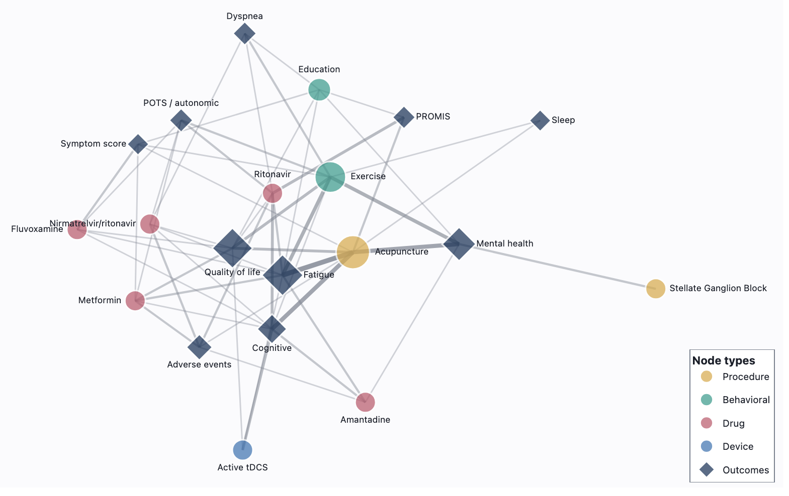

# APTA-BIOTECK · Post-COVID Text-to-Graph Framework

**Collaboration:** Fraunhofer SCAI × APTA / BIOTECK  
**Scope:** Transforming fragmented Post-COVID / Long COVID / PASC clinical evidence into a structured, reproducible, graph-queryable knowledge layer  
**Status:** Active · Task-gated delivery  
> 🌐 **Live dashboard → [https://postcovid-apta.netlify.app](https://postcovid-apta.netlify.app)**
> 

---

## What this project does

Post-COVID research is scattered across hundreds of clinical trials, observational studies, and case reports — written in natural language, inconsistently reported, and hard to query systematically.

This framework builds a pipeline that ingests that literature and outputs a structured **knowledge graph**: entities (interventions, populations, endpoints, mechanisms), relationships between them, and evidence scores tied to source documents. The result is a queryable evidence layer that can answer questions like:

- Which interventions have been tested for Post-COVID conditions, and with what outcomes?
- Which patient populations and cohort characteristics are most represented?
- Which clinical endpoints are measured most consistently across trials?
- Which mechanistic hypotheses have the strongest evidential support?
- What is strong enough to inform future trial design or therapeutic prioritisation?

---

## Architecture overview

```
Biomedical Literature (PubMed · PMC · ClinicalTrials.gov · PDF)
        │
        ▼
  Named Entity Recognition
  (SciSpaCy + UMLS semantic typing)
        │
        ▼
  Relation Extraction
  (GPT-4o · reproducible · temperature=0 · pinned model snapshot)
        │
        ▼
  Structured Triples
  (entities · relationships · provenance · evidence weights)
        │
        ▼
  Neo4j Knowledge Graph
  (queryable · evidence-scored · conflict-flagged · auditable)
```

Every extraction run is stamped with a run ID, model version, and SHA-256 corpus hash — making results fully reproducible and auditable.

---

## Project structure

The project is organised into five modular tasks. Each task has its own deliverables and a go/no-go review point before the next stage begins.

| Task | Name | Deliverable |
|------|------|-------------|
| [Task 01](./Task01_Curated_Corpus/) | Foundation — Curated Post-COVID Study Corpus | Curated corpus · structured study catalogue · interactive dashboard |
| [Task 02](./Task02_KG_Schema_CDM/) | KG Schema & Common Data Model | Documented schema · entity mapping rules · harmonisation workflows |
| [Task 03](./Task03_SCAIView_Optional/) | SCAIView Semantic Search *(optional)* | Annotated corpus · semantic search interface |
| [Task 04](./Task04_TextToGraph_Extraction/) | Text-to-Graph Extraction | Normalised triple dataset — endpoints, cohort descriptors, temporal context |
| [Task 05](./Task05_Evidence_KG/) | Evidence-Weighted Knowledge Graph | Neo4j KG with evidence scoring · provenance · query workflows |

---

## Repository layout

```text
APTA_PostCOVID_TextToGraph/
│
├── README.md                          ← this file
├── assets/
│   └── kg_preview.png                 ← knowledge graph preview
│
├── 00_Project_Documents/
│   ├── APTA_Proposal.pdf
│   ├── project_timeline.pdf
│   └── decision_log.md
│
├── Task01_Curated_Corpus/
│   ├── README_Task01.md
│   ├── 01_Dashboard/                  ← interactive HTML viewer
│   ├── 02_Catalogues_CSV/
│   ├── 03_Methods_Provenance/
│   ├── 04_AI_Audit_Trail/
│   └── 05_Archive/
│
├── Task02_KG_Schema_CDM/
│   ├── README_Task02.md
│   ├── schema_documentation/
│   ├── entity_mapping_rules/
│   ├── controlled_vocabularies/
│   └── review_materials/
│
├── Task03_SCAIView_Optional/
│   ├── README_Task03.md
│   ├── scaiview_instance_notes/
│   ├── annotation_configuration/
│   └── quality_review/
│
├── Task04_TextToGraph_Extraction/
│   ├── README_Task04.md
│   ├── extraction_outputs/
│   ├── normalised_triples/
│   ├── qa_reports/
│   └── provenance/
│
└── Task05_Evidence_KG/
    ├── README_Task05.md
    ├── neo4j_export/
    ├── graph_schema/
    ├── evidence_scoring/
    ├── example_queries/
    └── final_review_materials/
```

---

## Reproducibility

All pipeline outputs are designed to be fully reproducible:

- **Model pinning** — GPT calls use dated model snapshots (e.g. `gpt-4o-2024-08-06`), not floating aliases
- **Deterministic extraction** — `temperature=0` across all LLM calls
- **Corpus hashing** — SHA-256 hash stored per run to detect corpus drift
- **Run manifests** — every extraction run logged with ID, timestamp, model version, and parameter snapshot
- **Externalized configuration** — prompts and domain parameters live in version-controlled files, not hardcoded

---

## Confidentiality

This repository is shared under the terms of the Fraunhofer SCAI · APTA collaboration agreement. Contents are confidential and intended for project stakeholders only.

---

*Fraunhofer Institute for Algorithms and Scientific Computing (SCAI) · Sankt Augustin, Germany*
